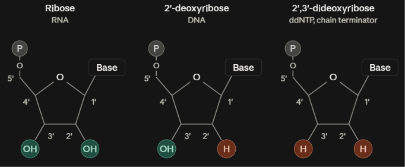
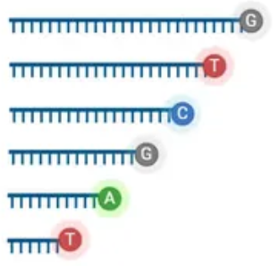

# Nucleic acid (DNA) sequencing

Brief history: idea pioneering in 1977 by Sanger, called Sanger sequencing (1st generation sequencing). Massively-parallel = next generation = 2nd generation sequencing became a thing in early 2000s.

## Sanger sequencing

Requires: DNA sample to be sequenced, DNA polymerase (enzyme which replicates the strand), dNTPs (deoxynucleotides which are used by DNA polymerase), ddNTPs (dideoxynucleotides).

DNA sample is replicated via polymerase chain reaction.

The replicated DNA is then subjected to heat to denature the strands and rather than being the dsDNA (double-stranded DNA) turns into ssDNA (single stranded DNA). 

Primers (small ssDNA fragments which initate replication process) are attached to the ssDNA strands. These complexes are then split into 4 distinct solutions each containing all the requirements, except each has a single kind of ddNTP (one of ddATP, ddGTP, ddCTP, ddTTP). The relevance of the ddNTPs are that they are chain terminating. Meaning that the fragment cannot be further elongated after incorporating one of those bases.

So after subjecting the ssDNA+primer complexes to those solutions we will have a set of fragments of varying lengths due to the termination of ddNTPs at different points. 

We can then sort these fragments using gel electrophoresis (which sorts fragments based on length) and determine the order of the sequence. 

## Massively parallel sequencing

As name implies want to sequence numerous DNA samples simultaneously.

Start from cDNA oligonucleotide as generated via scRNA-seq (or other approaches). Append a nucleotide adapter onto the beginning and end of the sequence. 
- 5' [Adapter]-[PCR handle]-[barcode]-[UMI]-[CDS]-[Adapter] 3'
  - CDS = coding region of the cDNA which is what we really want to sequence

We have a chip (flat plate structure) with many adapter binding regions on it. Then we administer our cDNA oligonucleotides onto the plate. The plate is large enough such that individual cDNA oligonucleotides will bind in distinct spatial locations.

The cDNA oligonucleotides are then replicated in place (this is called the bridge amplification method; look into if you'd like) such that spatial clusters of the cDNA oligonucleotide duplicates are formed. Each spatial cluster is associated with one cDNA oligonucleotide we want to sequence. The fact there are multiple clusters is what makes this parallel sequencing.

We then proceed through cycles which are defined by adding a dNTP molecule which is conjugated to a fluorescent molecule (the dNTP will glow a discriminating color), using a camera to read that color, and then removing just the fluorescent molecule off that dNTP. This occurs at each of the clusters. 
- The dNTP also has a blocking group attached which functions similarly to ddNTPs by preventing elongation of the strand giving the camera enough time to identify the color
- The amount of cycles we do is equivalent to the read-length of the sequencing (i.e. how many bases do we sequence). 
- All the duplicates in a cluster are relatively in-sync throughout these cycles. That is they all maintain a similar length.
  - The lengths do differ as the number of cycles increases and this creates a distribution of fluorescent colors which weakens the ability of the camera to sequence the strand. That is why read-lengths are generally kept low. The homogeneity of this distribution is what the quality scores are (at every position which is sequenced a confidence is reported). 

After we've achieved the desired read-length we've sequenced our DNA.